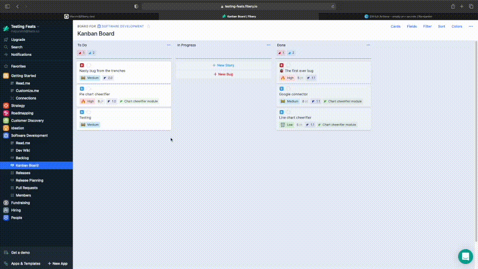

# fibery-test



## Pull request title format

```
fibery/["ip-"?][type]#[number]["(main)"?]: foo-bar
```

Here,

`ip- = in progress`

`type = fibery entity type you want to link (story, bug etc.)`,

`number = unique number of that entity`

`(main) without quote, is optional and should be only passed when merge event of this pull request could effect that entity (merged => done)`

Example:

`fibery/story#1: foo-bar`

`fibery/bug#2(main): foo-bar`

`fibery/ip-story#3: foo-bar`

test test
